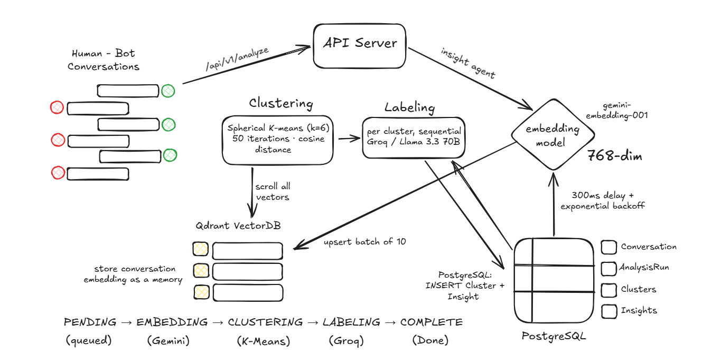

# BotOS(Architecture) - Sentiment analytics engine



## Pipeline (async)

```
POST /analyze → 202 Accepted { runId }

         EMBEDDING → CLUSTERING → LABELING → COMPLETE
              ↑            ↑           ↑
         Gemini        K-means       Groq
         + Qdrant      (k=6)       Llama 3.3 70B
```

`AnalysisRun` is a state machine. Client polls `GET /runs/:id/status` every 2s. No HTTP timeout — the pipeline runs fire-and-forget in-process.

---

## What We Use and Why

**PostgreSQL (Neon)**
- Conversations, clusters, and insights are relational. Filtering insights by runId + severity + status is a WHERE clause, not a scan.
- `AnalysisRun` models the pipeline as a state machine — clean polling, visible failure point.
- Neon: serverless, free tier, zero config.

**Qdrant Cloud**
- Vectors need to live separately from Postgres. Co-location creates resource contention during embedding (CPU-bound I/O and disk both spike).
- Scroll API lets us pull all 50–5,000 vectors in one pass for in-memory clustering. No ANN needed at this scale — we want exact assignments.
- UUID point IDs match Prisma's generated IDs directly. No mapping layer.

**Gemini `gemini-embedding-001` (768-dim)**
- Only embedding model with a real free tier for English text.
- 768 dims is the model's native output — not a truncation. Sufficient to separate "billing failure" from "delivery failure" from "claims delay" in cosine space.
- Sequential calls with 300ms delay + exponential backoff on 429. At paid tier: re-enable batching.

**Spherical K-means (k=6)**
- Tried BFS cosine threshold first. Failed: all support conversations share "complaint → resolution" structure. The graph collapsed into one mega-cluster.
- K-means with fixed k=6 guarantees exactly 6 insight cards — the number a PM can act on in a sprint.
- Spherical variant (normalized centroids, cosine distance) fits high-dimensional embedding space better than Euclidean K-means.
- Silhouette score exposed in run status. Above 0.3 = good separation. Below 0.1 = wrong k for this dataset.

**Groq + Llama 3.3 70B**
- LPU hardware: 6 clusters labeled in ~3–4 seconds. Same work on standard GPU: 20–30 seconds.
- `response_format: { type: "json_object" }` guarantees parseable output every call.
- Prompt hard-bans vague language ("experience", "journey", "seamless"). Forces specific broken system in headline, specific component in recommendation.

---

## Data Model

```
AnalysisRun
  id, status: PENDING → EMBEDDING → CLUSTERING → LABELING → COMPLETE | FAILED
  totalConversations, clustersFound, silhouetteScore
  startedAt, completedAt

Conversation
  id, messages (JSON array), fullText (flattened string for embedding)
  clusterId → Cluster
  messageCount, resolved, conversationAt

Cluster
  id, runId, label, size, percentage
  priorityScore = affectedPercent × severityWeight
  trend: NEW | GROWING | STABLE | SHRINKING

Insight
  id, runId, clusterId
  headline, detail, recommendation
  severity: CRITICAL | HIGH | MEDIUM | LOW
  affectedPercent, affectedCount, exampleQuotes[]
  status: NEW → ACKNOWLEDGED → IN_PROGRESS → RESOLVED | DISMISSED
```

---

## Scalability

| Scale | Bottleneck | Fix |
|---|---|---|
| 50–500 convos | Gemini free tier rate limits | Sequential + backoff (current) |
| 500–5,000 convos | Embedding throughput | Switch to Gemini paid tier, batch calls |
| 5,000–50,000 convos | In-process pipeline fragility | BullMQ + Redis job queue — survives restarts, supports retries |
| 50,000+ convos | K-means in 768-dim space | UMAP (768→20 dims) + HDBSCAN — natural cluster shapes, no fixed k |
| Multi-tenant | Shared Qdrant collection | One collection per tenant + Postgres schema isolation |
| Real-time | Seed-from-JSON approach | Webhook endpoints for Intercom / Zendesk / Freshdesk, rolling 7-day window |

K-means memory: 5,000 × 768 floats × 4 bytes = ~15MB. Fits comfortably in process. At 50,000 conversations it's 150MB and the spherical cluster assumption starts breaking down — that's when UMAP + HDBSCAN is worth the complexity.

---

## Reasoning

**Why not HDBSCAN now?**
No production JS/TS library. It also classifies 30–40% of points as noise at typical settings — those conversations get no insight card. For a PM dashboard, every conversation should contribute to signal. K-means guarantees coverage.

**Why not MongoDB?**
No multi-document transactions. Writing to Conversation, Cluster, and Insight atomically per cluster requires a real transaction. PostgreSQL handles this trivially.

**Why not pgvector?**
Co-location with Postgres creates contention. Embedding is CPU and network bound; running it against the same instance that's serving relational queries degrades both. Also, full-table cosine scans without HNSW are slow past ~10k vectors.

**Why not OpenAI embeddings?**
No free tier. Requires billing setup before the first API call. Gemini AI Studio gives free access with comparable quality on English support text.

**Why async pipeline with polling?**
Embedding 50 conversations takes 30–120 seconds depending on rate limits. A synchronous HTTP response would time out. 202 Accepted + polling is the correct HTTP pattern for work that takes longer than a connection timeout.
